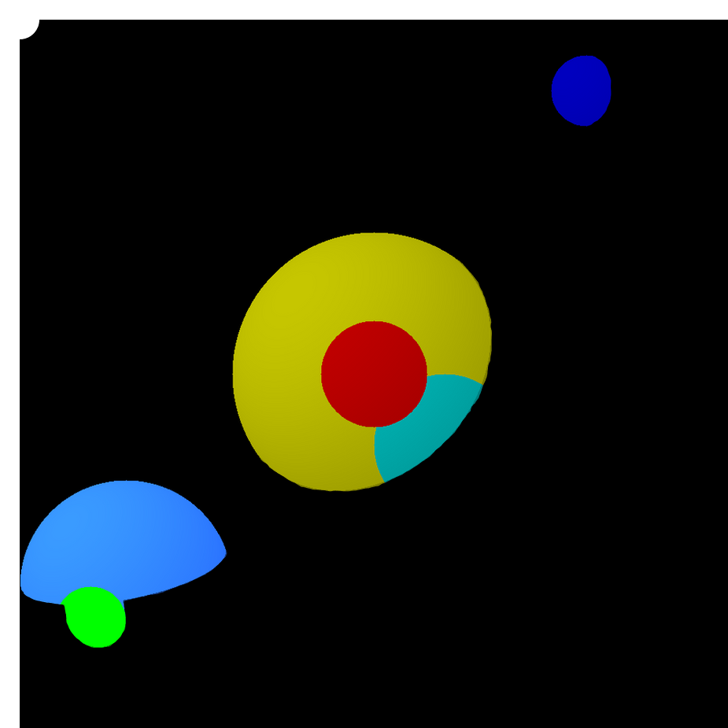

# Première scène

Dossier de rendu        : raytracer <br>
Fichier de rendu        : struct.h, utils.c, headers.h <br>
Fonctions autorisées    : 
---

Écrire un programme qui enregistre une image ppm de la scène suivante :
- Plusieurs sphères de tailles, positions, et couleurs différentes
- Une lumière blanche
- Une camera

Pour chaque pixel de l'image, on va regarder si celui-ci voit une sphère. Si oui, on va calculer si ce pixel est éclairé ou non  (s'il y a une intersection entre la sphère et la lumière). Si oui, on éclairera le pixel avec la couleur de la sphère. Sinon, on le laissera noir.

Vous pouvez modifier la fonction 
```C
int intersect_ray_sphere(const Ray ray, const Sphere sphere);
``` 
pour qu'elle ressemble à ceci :
```C
Intersection intersect_ray_sphere(const Ray ray, const Sphere sphere);
```

<details>
  <summary>Structure Intersect</summary>
  
  Ce spoiler propose une implémentation de la structure Intersection. Il est conseillé de faire vous même votre propore implémentation. Cependant, si vous avez des difficultés, vous pouvez vous aider de cette solution.
  
  <details>
  <summary>Implémentation Intersect</summary>
  
  ```C
typedef struct t_intersection
{
    int intersect;
    float distance;
    Vector3 position;
    int nbIntersections;
    Sphere sphere;
} Intersection;
  ```
  </details>
</details>

*Faites des **tests unitaires**. Par pitié, par Odin ! Nom d'une pipe.*

---

Resources utiles :
- Résultat exemple d'une scène avec 6 sphères + une lumière blanche dans le coin supérieur gauche : 
<br>Dans cet exemple, la lumière est en (0, 0, 0) toutes les sphères ont un z positif
